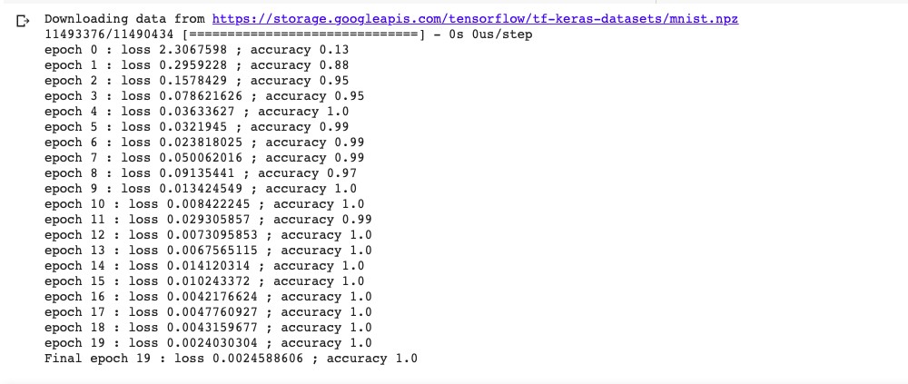

# TensorFlow 2.0 Overview

TensorFlow 2.0 is both simple and flexible, focusing on features like:
- Fast model design and high-level control with Keras
- Estimator API for machine learning workflows, with premade models for regression, boosted trees, and random forests
- Eager execution for imperative programming, with AutoGraph for taking advantage of graph execution
- SavedModel for exporting trained models and deploying on any platform

- **tf.keras:** A high-level, object-oriented API for fast prototyping of deep learning models
- **tf.GradientTape:** Records gradients on-the-fly for automatic differentiation and backprop
- **tf.function:** Pre-compile computational graphs from python functions with AutoGraph

1. [Fully-connected Network] () 

- we'll train a fully-connected neural network for MNIST handwritten digit recognition.


2. [Convolutional Network] () - 

- Convolution, pooling, and dropout layers for building more complex models
- Visualizing training with TensorBoard
- Validation and test set evaluation for measuring generalizability
- Exporting with SavedModel to save training progress and deploy trained models


# Try it for yourself!
Train MNIST with a **fully connected network**:
```
python fc_train.py
```



Train MNIST with a **convolutional network**:
```
python conv_train.py
```