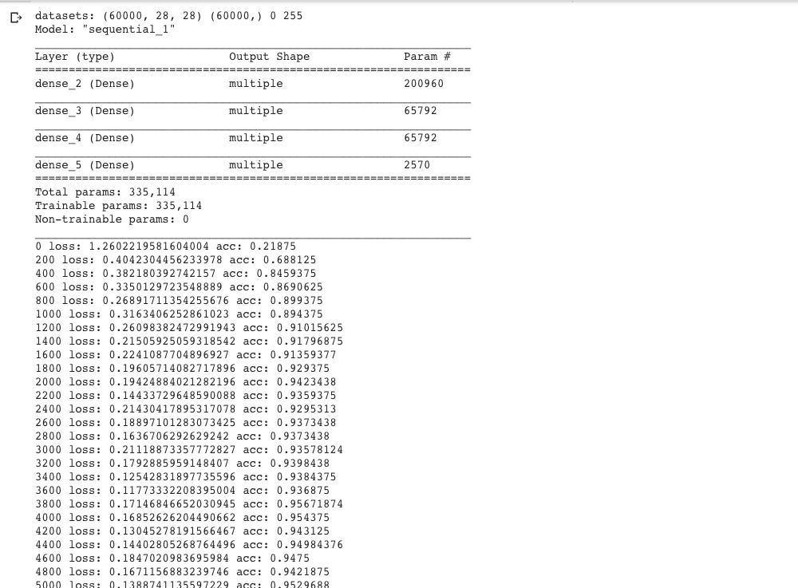
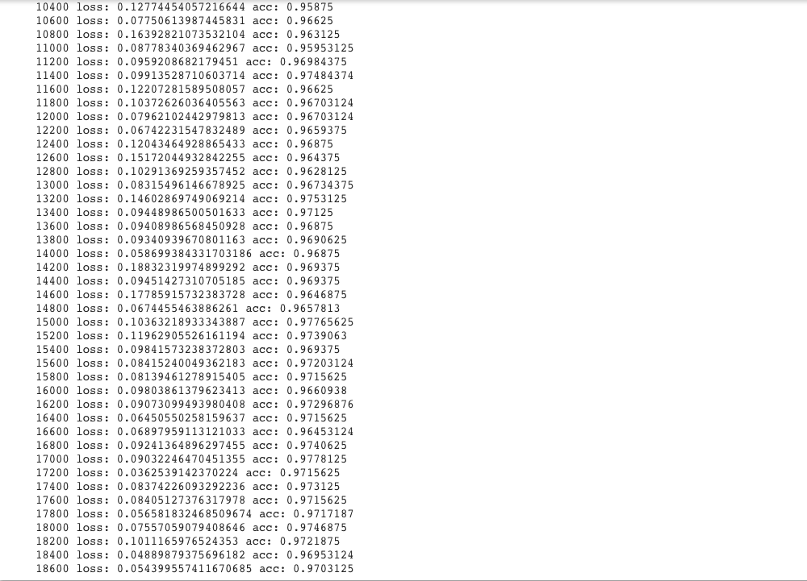
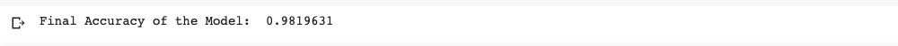

# Code a MNIST


Now let's build our network as a **keras.Sequential** model and instantiate a stochastic gradient descent optimizer from **keras.optimizers**.


Finally, we can iterate through our dataset and train our model.
In this example, we use **tf.GradientTape** to manually compute the gradients of the loss with respect to our network's trainable variables. GradientTape is just one of many ways to perform gradient steps in TensorFlow 2.0:

- **Tf.GradientTape:** Manually computes loss gradients with respect to given variables by recording operations within its context manager. This is the most flexible way to perform optimizer steps, as we can work directly with gradients and don't need a pre-defined Keras model or loss function.
- **Model.train():** Keras's built-in function for iterating through a dataset and fitting a Keras.Model on it. This is often the best choice for training a Keras model and comes with options for progress bar displays, validation splits, multiprocessing, and generator support.
- **Optimizer.minimize():** Computes and differentiates through a given loss function and performs a step to minimize it with gradient descent. This method is easy to implement, and can be conveniently slapped onto any existing computational graph to make a working optimization step.


# Try it for yourself!

```
python main.py
``` 
## Output





