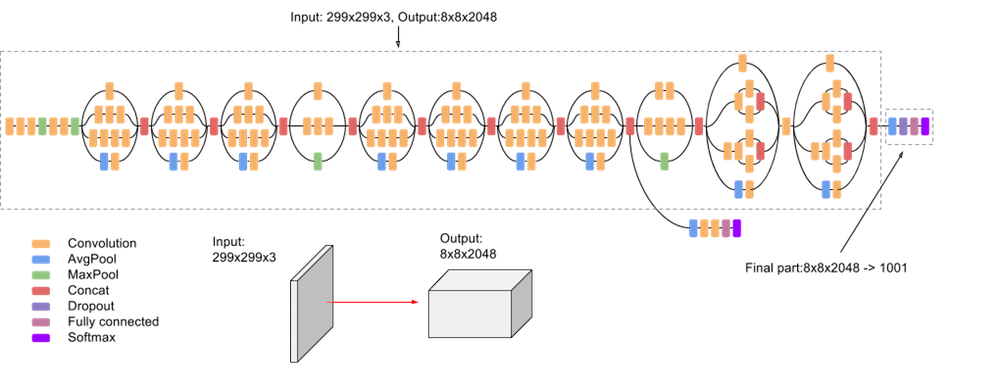

# Inception Network

Here we train a tf.keras implementation of InceptionV3 on MNIST.

Includes cell dividers for running with IPython!



# Try it for yourself!

```
python main.py
```
## Output


