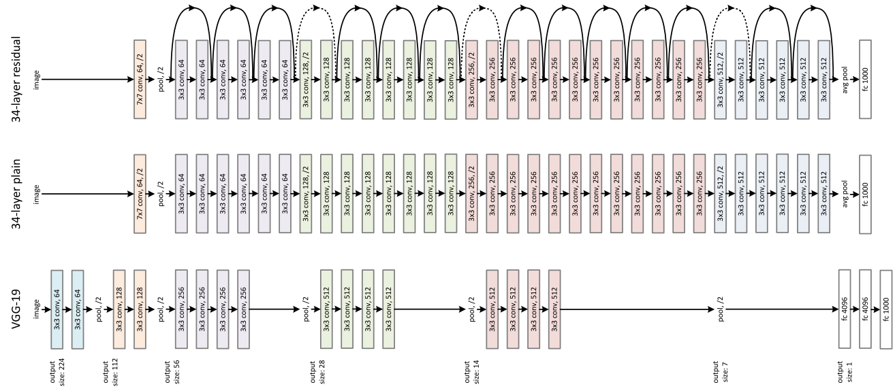
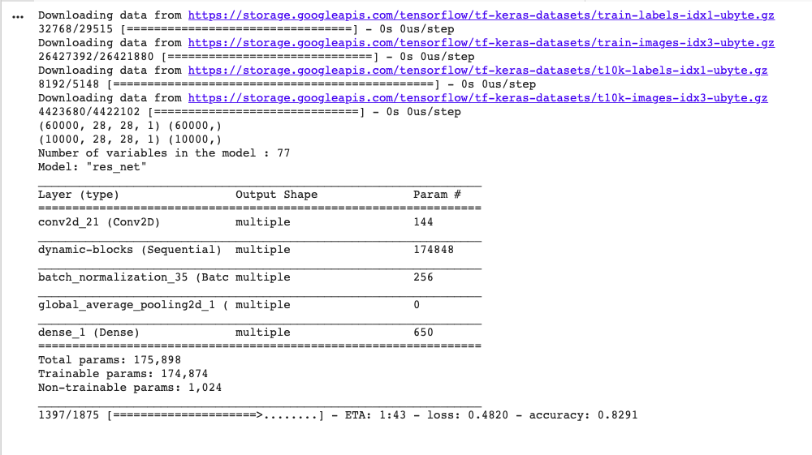
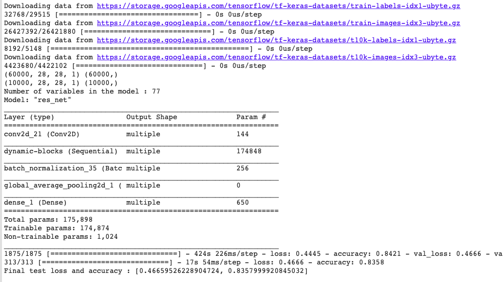

# ResNet 

Here we train a tf.keras implementation of ResNet-18 on Fashion-MNIST.

Includes cell dividers for running with IPython!



# Try it for yourself!

```
python main.py
```

## Output



